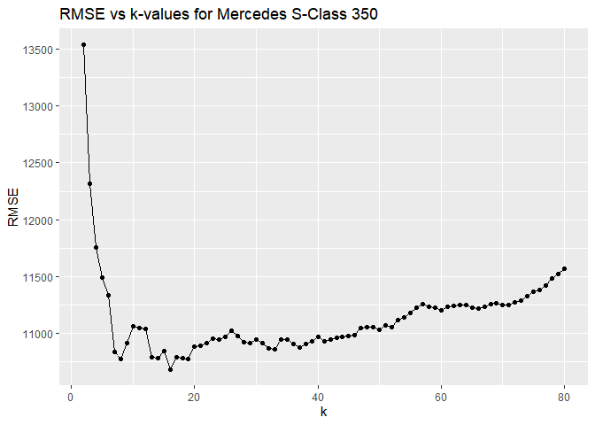
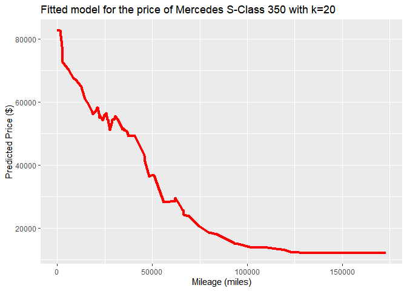
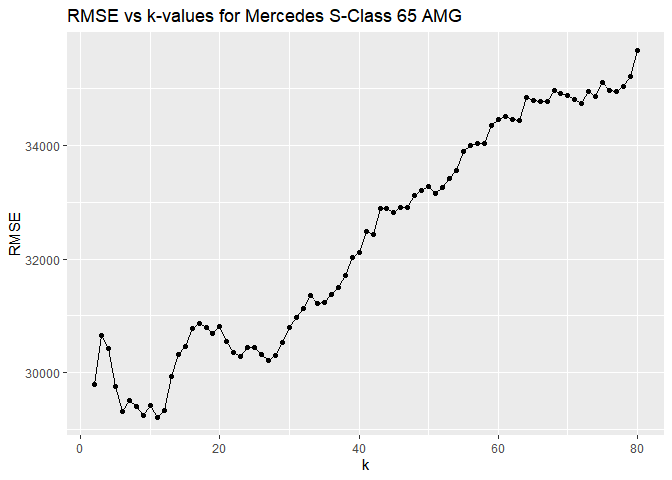
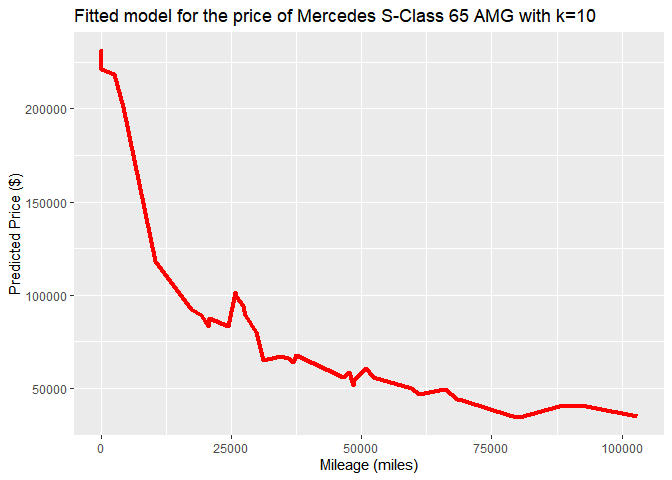

# DataMining\_PS1

## Pranjal Maheshka, Asha Christensen, Marco Navarro

### 2023-01-30

## Question 2 - Wrangling the Olympics

### A)

<table>
<thead>
<tr class="header">
<th>Percentiles</th>
<th style="text-align: center;">Height</th>
</tr>
</thead>
<tbody>
<tr class="odd">
<td>5%</td>
<td style="text-align: center;">159</td>
</tr>
<tr class="even">
<td>25%</td>
<td style="text-align: center;">166</td>
</tr>
<tr class="odd">
<td>50%</td>
<td style="text-align: center;">170</td>
</tr>
<tr class="even">
<td>75%</td>
<td style="text-align: center;">175</td>
</tr>
<tr class="odd">
<td>95%</td>
<td style="text-align: center;">183</td>
</tr>
</tbody>
</table>

Percentiles of heights for female competitors across all Athletics
events <dbl> 5% 159 25% 166 50% 170 75% 175 95% 183

The 95th percentile of heights for female competitors across all
Athletics events 183 centimeters.

### B)

    ## # A tibble: 10 × 2
    ##    event                                 Standard_Deviation
    ##    <chr>                                              <dbl>
    ##  1 Rowing Women's Coxed Fours                         10.9 
    ##  2 Basketball Women's Basketball                       9.70
    ##  3 Rowing Women's Coxed Quadruple Sculls               9.25
    ##  4 Rowing Women's Coxed Eights                         8.74
    ##  5 Swimming Women's 100 metres Butterfly               8.13
    ##  6 Volleyball Women's Volleyball                       8.10
    ##  7 Gymnastics Women's Uneven Bars                      8.02
    ##  8 Shooting Women's Double Trap                        7.83
    ##  9 Cycling Women's Keirin                              7.76
    ## 10 Swimming Women's 400 metres Freestyle               7.62

If we use standard deviation as a measure of variability, Swimming
Women’s 100 metres Butterfly is the single women’s event that had the
greatest variability in competitor’s heights across the entire history
of the Olympics.

### C)

The average age of male swimmers in the Olympics presents an upward
trend during the first period (100-1924), reaching its maximum (32
years) in the 1924 summer Olympics. After that peak, the average fell
dramatically and remained relatively constant around 20 years in the
following 5 decades. In most recent years, it shows again an increasing
trend and it reached 24 years during the 2016 Olympics. On the other
hand, the first Olympics with date for female swimmers was 1924 and
their average age was 18 years old. That average remains relatively
constant for fifty years and started to show a growing trend since 1984.
As a result of this trend, the average age of female swimmers was 22
years old in the 2016 Olympics in Rio de Janeiro. In general, both group
of swimmers presents similar trends, the average remained relatively
constant from mid-1920s to 1980 and started to show an increase in the
last 4 decades.

## Question 3 - K-Nearest Neighbors Regression for S-Class Cars

The data set contains over 29,000 Mercedes S-Class vehicles. It was
subset down to include price and mileage for the 350 and 65 AMG trim
levels only. The data for each trim level was split in an 80/20 ratio
corresponding to train/test splits.

## Mercedes S-Class 350

The RMSE values for the 350 trim usually range from 9,500 to 12,500 for
k-values from 2-80. The lowest RMSE has a different k-value for each
iteration of code because of the randomized train/test splits. The
k-value associated with the lowest RMSE value ranged from 8 to 73. Given
the general shape of the RMSE-k plot, and in order to find a balance
between a low RMSE and a smoother prediction curve - the k-value chosen
for the model is 20.

Below is a plot of the fitted model, i.e. predictions vs price. At k=20
there is lesser variation in the curve (less wiggly) than a lower
k-value while having a relatively low RMSE.

    ## Warning: Using `size` aesthetic for lines was deprecated in ggplot2 3.4.0.
    ## ℹ Please use `linewidth` instead.

## Mercedes S-Class 65 AMG

The RMSE values for the 65 AMG trim usually range from 15,000 to 32,000
for k-values from 2-80. The lowest RMSE has a different k-value for each
iteration of code because of the randomized train/test splits. The
k-value associated with the lowest RMSE value ranged from 3 to 36. Given
the general shape of the RMSE-k plot, and in order to find a balance
between a low RMSE and a smoother prediction curve - the k-value chosen
for the model is 10.

Below is a plot of the fitted model, i.e. predictions vs price. At k=10
there is lesser variation in the curve (less wiggly) than a lower
k-value while having a relatively low RMSE.

The 350 trim has data points ranging from $6,600 to 106,010 while the 65
AMG trim has data points ranging from $18,990 to $247,075 and there is
significantly more variation in the data for the 65 AMG than the 350.
The RMSE values are consistently much higher for the 65 AMG than the
350. The variation in the data can be attributed to the fact that the 65
AMG is an ultra-premium luxury sports car while the 350 is a luxury
sedan that sees a much wider audience and much higher sales globally.
The exact condition of the 65 AMG and potential sub-trims or add-ons
could affect resale price greatly relative to the 350.

Accordingly, the 350 trim sees higher k-values with lower RMSE values
thus resulting in the final pick of k=20. Given the greater variation in
price vs mileage for the 65 AMG, lower k-values consistently were
associated with the minimum RMSE value and accordingly k=10 was chosen
for the 350 trim and k=20 was chosen for the 65 AMG trim.
