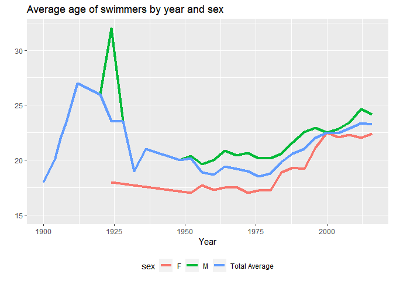

# 2) Wrangling the Olympics

## A)

    ##     Percentiles of heights for female competitors across all Athletics events
    ## 5%                                                                        159
    ## 25%                                                                       166
    ## 50%                                                                       170
    ## 75%                                                                       175
    ## 95%                                                                       183

The 95th percentile of heights for female competitors across all
Athletics events 183 centimeters.

## B)

    ## # A tibble: 10 × 2
    ##    event                                 Standard_Deviation
    ##    <chr>                                              <dbl>
    ##  1 Rowing Women's Coxed Fours                         10.9 
    ##  2 Basketball Women's Basketball                       9.70
    ##  3 Rowing Women's Coxed Quadruple Sculls               9.25
    ##  4 Rowing Women's Coxed Eights                         8.74
    ##  5 Swimming Women's 100 metres Butterfly               8.13
    ##  6 Volleyball Women's Volleyball                       8.10
    ##  7 Gymnastics Women's Uneven Bars                      8.02
    ##  8 Shooting Women's Double Trap                        7.83
    ##  9 Cycling Women's Keirin                              7.76
    ## 10 Swimming Women's 400 metres Freestyle               7.62

If we use standard deviation as a measure of variability, Swimming
Women’s 100 metres Butterfly is the single women’s event that had the
greatest variability in competitor’s heights across the entire history
of the Olympics.

## C)

The average age of male swimmers in the Olympics presents an upward
trend during the first period (100-1924), reaching its maximum (32
years) in the 1924 summer Olympics. After that peak, the average fell
dramatically and remained relatively constant around 20 years in the
following 5 decades. In most recent years, it shows again an increasing
trend and it reached 24 years during the 2016 Olympics. On the other
hand, the first Olympics with date for female swimmers was 1924 and
their average age was 18 years old. That average remains relatively
constant for fifty years and started to show a growing trend since 1984.
As a result of this trend, the average age of female swimmers was 22
years old in the 2016 Olympics in Rio de Janeiro. In general, both group
of swimmers presents similar trends, the average remained relatively
constant from mid-1920s to 1980 and started to show an increase in the
last 4 decades.
